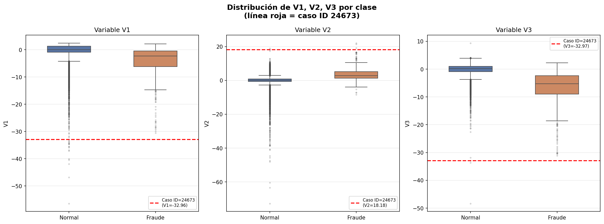

# 🏦 Detección de Fraude Bancario
### Parcial Práctico — Machine Learning con PySpark y Docker
**Valentina Muñoz | Universidad Santo Tomás | Estadística 2026-I**

---

## 📋 Descripción del Problema

Una entidad bancaria europea registra millones de transacciones diarias. Detectar manualmente las fraudulentas es imposible. Este proyecto construye un sistema automatizado de detección de fraude bancario usando Machine Learning distribuido con PySpark, comparando 3 modelos diferentes y entregando predicciones en formato competencia Kaggle.

El dataset presenta un desbalance extremo: **solo el 0.17% de las transacciones son fraude**, lo que hace que la métrica principal sea el **F1-Score sobre la clase fraude (Class=1)**, no el accuracy general.

---

## 📁 Estructura del Repositorio

```
ValentinaMuñoz_ParcialPractico/
├── notebooks/
│   └── parcial_ValentinaMuñoz.ipynb
├── docker/
│   ├── Dockerfile
│   └── docker-compose.yml
├── submission.csv
├── reporte.pdf
└── README.md
```

---

## 📊 Datos

| Archivo | Filas | Descripción |
|---|---|---|
| `train.csv` | 199,365 | Datos de entrenamiento con etiquetas (Class) |
| `test.csv` | 42,720 | Datos de prueba sin etiquetas |
| `sample_submission.csv` | 42,720 | Formato de entrega |

**Variables:** `Time`, `V1`–`V28` (componentes PCA anonimizados), `Amount`, `Class` (0=normal, 1=fraude)

---

## 📉 Desbalance de Clases


> La clase fraude representa únicamente el **~0.17%** del total de transacciones, lo que hace que métricas como accuracy sean engañosas. Por esto se usa F1-Score sobre Class=1 como métrica principal.

---

## ⚙️ Metodología

### Preprocesamiento
- Verificación de nulos (ninguno encontrado)
- División train/validation: **80%/20%** con semilla `3463`
- Balanceo por **oversampling moderado (10×)** sobre la clase fraude para reducir falsos positivos sin perder recall

### Pipeline
```
VectorAssembler → StandardScaler → Modelo
```

### Modelos entrenados
1. **Regresión Logística** (baseline obligatorio) — PySpark MLlib
2. **Random Forest** (100 árboles) — PySpark MLlib
3. **LinearSVC** (modelo asignado) — PySpark MLlib

---

## 📈 Tabla Comparativa de Modelos

Todas las métricas corresponden a la clase fraude (Class=1) evaluadas sobre el conjunto de validación:

| Modelo | F1 | Precision | Recall | AUC-ROC |
|---|---|---|---|---|
| Regresión Logística | 0.8221 | 0.8590 | 0.7882 | 0.9878 |
| **Random Forest ✓** | **0.8765** | **0.9221** | **0.8353** | **0.9832** |
| LinearSVC | 0.8625 | 0.9200 | 0.8118 | 0.9872 |

**Mejor modelo: Random Forest** → usado para generar `submission.csv`

---

## 🔍 Análisis de Variables Atípicas

Los siguientes boxplots muestran la distribución de V1, V2 y V3 por clase. La línea roja corresponde al caso ID=24673 (Falso Positivo analizado en la Pregunta 3):



Se observa que los valores de V1=-32.96 y V3=-32.97 del caso analizado están muy por fuera de la distribución de ambas clases, lo que explica la confusión del modelo.

---

## ❓ Preguntas de Sustentación

### Pregunta 1 — Bitácora de Experimentos (LinearSVC)

| # | Hiperparámetro | Valor anterior | Valor nuevo | F1 (validation) | Decisión |
|---|---|---|---|---|---|
| 1 | regParam  | 0.1 | 0.01 | 0.8383 , 0.8383 | igual |
| 2 | maxIter | 10 | 20 | 0.8625 , 0.8383 | empeoro |
| 3 | regParam | 0.1 | 0.3 | 0.8625 , 0.8182 | empeoro |
| 4 | threshold | 0.0 | 0.3 | 0.8625 , 0.8105 | empeoro |
| 5 | threshold | 0.0 | 0.8 | 0.8625 , 0.8105 | empeoro |


---

### Pregunta 2 — Semilla Personal

**a) Semilla utilizada:** `3463` (últimos 4 dígitos de cédula)

**b) Tamaño de los conjuntos con esa semilla:**

| Conjunto | Filas |
|---|---|
| Train interno | 159,274 |
| Validation | 40,090 |

**c) Fraudes (Class=1) en cada conjunto:**

| Conjunto | Fraudes |
|---|---|
| Train interno | 259 |
| Validation | 85 |

**d) F1 exacto del modelo asignado (LinearSVC) en validation:**

```
F1-Score (regParam=0.1, maxIter=10, threshold=0.0) = 0.8625
```

---

### Pregunta 3 — Análisis de Errores Específicos

**a) Falsos Positivos con prob_fraude > 0.6** (predijo fraude, realidad era normal):

| ID | Class real | Predicción | Probabilidad fraude |
|---|---|---|---|
| 24673 | 0 | 1.0 | 0.8180 |
| 14548 | 0 | 1.0 | 0.7611 |
| 22178 | 0 | 1.0 | 0.6587 |

**b) Falsos Negativos** (predijo normal, realidad era fraude):

| ID | Class real | Predicción | Probabilidad fraude |
|---|---|---|---|
| 12501 | 1 | 0.0 | 0.3950 |
| 23583 | 1 | 0.0 | 0.2104 |
| 38300 | 1 | 0.0 | 0.1613 |

**c) Hipótesis estadística — Caso ID=24673 (Falso Positivo)**

Al inspeccionar las features del caso ID=24673, se observan valores extremadamente atípicos:
- **V1 = -32.96** y **V3 = -32.97**, ubicados a más de 6 desviaciones estándar de la media
- **V2 = 18.18**, también fuera del rango típico
- **Amount = 89.99**, monto moderado pero específico

**Hipótesis:** Esta transacción legítima comparte una *firma estadística atípica en el espacio PCA* con transacciones fraudulentas reales. El modelo no puede distinguir entre "atípico por fraude" y "atípico por comportamiento legítimo poco frecuente" (por ejemplo, una operación corporativa o internacional inusual). 

---

## 🐳 Instrucciones Docker

```bash
# 1. Clonar el repositorio
git clone https://github.com/tu-usuario/ValentinaMuñoz_ParcialPractico.git
cd ValentinaMuñoz_ParcialPractico

# 2. Levantar el contenedor
docker-compose up --build

# 3. Acceder a Jupyter
# Abrir en el navegador: http://localhost:8888

# 4. Correr el notebook
# notebooks/parcial_ValentinaMuñoz.ipynb → Run All
```

---

## 🏆 Resultado Final

| Métrica | Valor |
|---|---|
| Mejor modelo | Random Forest |
| F1-Score (fraude) | **0.8765** |
| AUC-ROC | 0.9832 |
| Fraudes detectados en test | Ver submission.csv |

---

